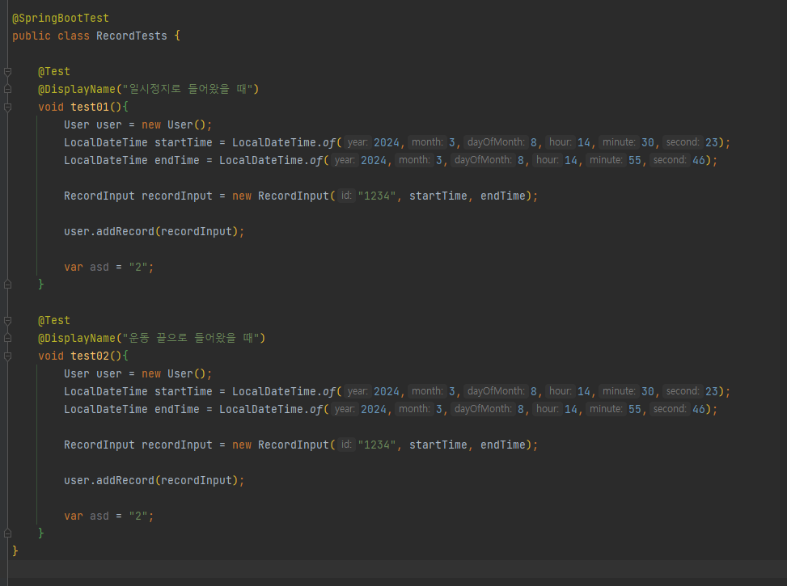

# 어플 운동햄
운동 기록 사이드 프로젝트

## 사용 기술 스택
- JAVA 17
- Spring Boot 3.2.3
- GraphQL
- MongoDB

## 인원
디자이너 2명  
프론트 1명  
백엔드 1명

## DB (Mongo DB)
네이밍  
https://typeof-undefined.tistory.com/11  
  
Embedding? vs Referencing?  
  
현재 상황은 Embedding이 맞는데 document 사이즈는 16MB.  
연도는 계속해서 붙을텐데 먼 미래이지만 사이즈는 무조건 한계치에 달할 수 있음.  
그렇다고 연도별로 컬렉션을 나눈다면? - 유저가 많아질경우 역시 사이즈가 16MB에 달할 수 있음  
아직 고민중  

03.14  
날짜 기록도 Embedding으로 결정 - 이유 ? 유저별로 샤딩할 생각  
샤딩은 해시 샤딩 생각중(만약 데이터가 많아진다면)  
유저 id를 기준으로 할 예정인데 범위 조회도 할 필요 없고 모든 데이터는 한 유저를 기반으로 가져올 생각이기 때문에  
근데 관리자 입장에서 이후 데이터 분석이 필요할 땐...?? ex) 어느 시간 대에 운동량이 제일 많은지... 조회 답이 없다 => 어차피 통계니 전체조회를 해야하는거 아닌가?  

03.25  
구조 변경  
user collection 하나로 관리하려는데 map으로 뽑아내려니 데이터 타입이 안맞아서 graphql로 안뽑히는중  
원인 찾기에 시간이 너무 오래걸리고 뎁스가 너무 깊어져서 다시 생각  
그래서 나온 결론  
user , record collection으로 가져가기  
record는 저번처럼 뎁스를 늘리지않고 그냥 record별로 쌓도록 진행  
이후 비즈니스 로직에서 record 업데이트 후 user 쪽 업데이트 하는 방식이 있는데 이 부분 트랜잭션이 안걸려 좀 고민해봐야함.

하 데이터모델링이 어렵구나...
맨 처음에 List로 했는데 Map이 나아보여 Map으로 변경
nosql을 처음 써보다 보니 뭔가 복잡하게 됐다
rdb면 그냥 조인해서 끝내면 될거같은데
앞으로는 좀 더 정교하게 짤 수 있도록 해야겠다

## 생각 정리. 이력
### 03.21  
단순 개발 진행 어려움 느껴 BDD방식으로 진행  
테스트코드가 익숙하지 않지만 확실히 필요성을 느끼게 됌

